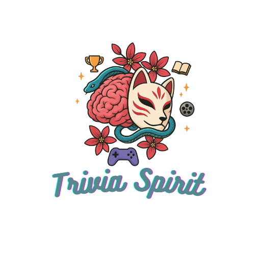

<p align="center">
  
</p>

<h1 align="center">🎮 Trivia Spirit Frontend</h1>

<p align="center">
  <strong>The Ultimate Trivia Game for Family & Friends</strong>
</p>

<p align="center">
  <a href="https://www.triviaspirit.com">Live application</a> ·
  <a href="https://github.com/Mohcen56/TriviaSpirit_frontend">Frontend source</a> ·
  <a href="https://github.com/Mohcen56/triviaspirit-backend-Nest.js">NestJS backend</a>
</p>

<p align="center">
  <a href="#features">Features</a> •
  <a href="#tech-stack">Tech Stack</a> •
  <a href="#architecture">Architecture</a> •
  <a href="#getting-started">Getting Started</a> •
  <a href="#project-structure">Project Structure</a> •
  <a href="#security">Security</a> •
  <a href="#api-reference">API</a>
</p>

<p align="center">
  
  
  
  
</p>

---

## ✨ Features

### 🎯 Core Gameplay
- **Turn-Based Trivia** – Create teams and take turns on one device
- **Custom Categories** – Browse, create, and save your favorite trivia categories
- **Thousands of Questions** – Curated questions across history, science, movies, anime, sports & more
- **Power-Ups & Perks** – Use Double Points, Reroll, and Show Choices to shape the game

### 👤 User Experience
- **Google OAuth** – One-click sign-in with Google
- **Profile Customization** – Custom avatars with image cropping
- **Game History** – Track your past games and performance
- **Responsive Design** – Seamless experience on mobile, tablet & desktop

### 💎 Premium Features
- **Membership System** – Unlock premium categories and features
- **LemonSqueezy Integration** – Secure payment processing
- **Ad-Free Experience** – No interruptions for premium users

---

## 🛠 Tech Stack

| Category | Technology |
|----------|------------|
| **Framework** | [Next.js 16](https://nextjs.org/) (App Router) |
| **UI Library** | [React 19](https://react.dev/) |
| **Language** | [TypeScript 5](https://www.typescriptlang.org/) |
| **Styling** | [Tailwind CSS 4](https://tailwindcss.com/) |
| **State Management** | [Redux Toolkit](https://redux-toolkit.js.org/) + [Redux Persist](https://github.com/rt2zz/redux-persist) |
| **Server State** | [TanStack Query](https://tanstack.com/query) (React Query) |
| **HTTP Client** | [Axios](https://axios-http.com/) via BFF Proxy |
| **Forms** | [React Hook Form](https://react-hook-form.com/) |
| **Animations** | [Framer Motion](https://www.framer.com/motion/) |
| **UI Components** | [Radix UI](https://www.radix-ui.com/) + [Lucide Icons](https://lucide.dev/) |
| **Auth Provider** | [Google OAuth](https://www.npmjs.com/package/@react-oauth/google) |
| **Monitoring** | [Sentry](https://sentry.io/) + [Vercel Analytics](https://vercel.com/analytics) |

---

## 🏗 Architecture

### Backend-for-Frontend (BFF) Pattern

All API calls are proxied through Next.js API routes, keeping authentication tokens secure:

```
┌─────────────────┐     ┌─────────────────┐     ┌─────────────────┐
│                 │     │                 │     │                 │
│  React Client   │────▶│  Next.js API    │────▶│  NestJS Backend │
│  (Browser)      │     │  (BFF Proxy)    │     │  (REST API)     │
│                 │     │                 │     │                 │
└─────────────────┘     └─────────────────┘     └─────────────────┘
        │                       │
        │                       │ HttpOnly Cookie
        │                       │ (Auth Token)
        ▼                       ▼
   No token visible      Token attached
   to JavaScript         server-side
```

### Route Groups

The app uses Next.js route groups for logical organization:

| Route Group | Purpose |
|-------------|---------|
| `(auth)` | Login, Signup, Password Reset |
| `(home)` | Dashboard, Categories, Profile, Settings |
| `(game)` | Game Board, Questions, Results |
| `api/` | BFF Proxy Routes, Auth Endpoints |

---

## 🚀 Getting Started

### Prerequisites

- Node.js 20+
- npm or yarn
- NestJS backend running (see the [NestJS backend README](https://github.com/Mohcen56/triviaspirit-backend/blob/main/README.md))

### Environment Variables

Create a `.env.local` file:

```env
# Private API URL used by server-side proxy and auth requests
BACKEND_API_URL=http://127.0.0.1:8000

# Public API URL used only to resolve media URLs in the browser
NEXT_PUBLIC_API_BASE_URL=http://127.0.0.1:8000

# Frontend URL
NEXT_PUBLIC_SITE_URL=http://localhost:3000

# Google OAuth
NEXT_PUBLIC_GOOGLE_OAUTH_CLIENT_ID=your-google-client-id

# Sentry (optional)
NEXT_PUBLIC_SENTRY_DSN=your-sentry-dsn
SENTRY_AUTH_TOKEN=your-sentry-auth-token
```

### Installation

```bash
# Install dependencies
npm install

# Start development server
npm run dev

# Build for production
npm run build

# Start production server
npm start
```

### Available Scripts

| Command | Description |
|---------|-------------|
| `npm run dev` | Start development server with hot reload |
| `npm run build` | Create optimized production build |
| `npm start` | Start production server |
| `npm run lint` | Run ESLint |
| `npm run analyze` | Analyze bundle size |

---

## 📁 Project Structure

```
src/
├── app/                      # Next.js App Router
│   ├── (auth)/               # Auth pages (login, signup)
│   ├── (game)/               # Game pages
│   │   └── game/[id]/        # Dynamic game routes
│   │       └── question/[questionId]/
│   ├── (home)/               # Main app pages
│   │   ├── categories/       # Browse & create categories
│   │   │   ├── CategoriesList.tsx    # Category browser
│   │   │   ├── add/
│   │   │   │   └── AddedCategoriesBrowser.tsx
│   │   │   ├── create/
│   │   │   │   └── CategoryCreator.tsx
│   │   │   └── edit/[id]/
│   │   │       └── CategoryEditor.tsx
│   │   ├── dashboard/        # User dashboard
│   │   ├── history/          # Game history
│   │   ├── plans/            # Pricing plans
│   │   │   └── PricingPlans.tsx
│   │   ├── profile/          # User profile
│   │   │   └── ProfileEditor.tsx
│   │   └── teams/            # Team setup
│   ├── api/                  # API Routes (BFF)
│   │   ├── auth/             # Auth cookie management
│   │   │   ├── check/        # Verify authentication
│   │   │   └── set-cookie/   # Set/clear auth cookie
│   │   └── backend/          # Catch-all proxy to NestJS
│   │       └── [...path]/    # Proxy all backend requests
│   ├── layout.tsx            # Root layout with providers
│   ├── page.tsx              # Landing page
│   └── middleware.ts         # Route protection
│
├── components/               # React Components
│   ├── ui/                   # Base UI components (buttons, dialogs)
│   ├── category/             # Category-related components
│   ├── game/                 # Game UI components
│   ├── User/                 # User profile components
│   └── Premium/              # Premium/membership components
│
├── hooks/                    # Custom React Hooks
│   ├── useCategoriesData.ts  # Categories fetching
│   ├── useGameData.ts        # Game state management
│   ├── useNotification.ts    # Toast notifications
│   └── useTurnTracking.ts    # Team turn management
│
├── lib/                      # Utilities & API
│   ├── api/                  # API client modules
│   │   ├── base.ts           # Axios instance (BFF proxy)
│   │   ├── auth.ts           # Auth endpoints
│   │   ├── categories.ts     # Categories CRUD
│   │   ├── games.ts          # Game management
│   │   └── questions.ts      # Question fetching
│   └── utils/                # Utility functions
│       ├── auth-utils.ts     # Auth helpers (cookie-based)
│       ├── logger.ts         # Structured logging
│       └── cn.ts             # Tailwind class merger
│
├── lib/config/               # Configuration
│   └── constants.ts          # Centralized app constants
│
├── store/                    # Redux Store
│   ├── index.ts              # Store configuration
│   ├── authSlice.ts          # Auth state (user only, no token)
│   ├── gameSlice.ts          # Game state
│   └── hooks.ts              # Typed Redux hooks
│
├── providers/                # React Context Providers
│   ├── Providers.tsx         # Unified provider wrapper
│   ├── SessionProvider.tsx   # User session context
│   ├── QueryProvider.tsx     # TanStack Query
│   └── NotificationProvider.tsx
│
├── contexts/                 # React Contexts
│
└── types/                    # TypeScript Definitions
    └── game.ts               # Game, User, Category types
```

---

## 🔐 Security

This project implements **industry-standard security practices**:

### ✅ Secure Authentication

| Practice | Implementation |
|----------|----------------|
| **HttpOnly Cookies** | Auth tokens stored in HttpOnly cookies, inaccessible to JavaScript |
| **BFF Proxy** | All API calls route through server, hiding backend URL |
| **Server-Side Auth** | Middleware validates auth before protected routes load |
| **No localStorage Tokens** | Tokens never stored in localStorage (XSS-safe) |
| **Secure Cookie Flags** | `httpOnly`, `secure`, `sameSite: lax` |

### 🛡️ Route Protection

```typescript
// middleware.ts - Server-side route protection
const protectedRoutes = ['/profile', '/game', '/dashboard', '/categories'];

export function middleware(request: NextRequest) {
  const authToken = request.cookies.get('authToken')?.value;
  
  if (isProtectedRoute && !authToken) {
    return NextResponse.redirect('/login?redirect=' + pathname);
  }
}
```

### 🔒 Token Flow

```
1. User logs in → NestJS returns token
2. Frontend calls POST /api/auth/set-cookie with token
3. Next.js sets HttpOnly cookie (token never in JS)
4. All API calls go through /api/backend/* proxy
5. Proxy reads cookie, attaches token to NestJS requests
6. On logout, DELETE /api/auth/set-cookie clears cookie
```

---

## 📡 API Reference

### Auth Endpoints

| Endpoint | Method | Description |
|----------|--------|-------------|
| `/api/auth/set-cookie` | POST | Set auth token in HttpOnly cookie |
| `/api/auth/set-cookie` | DELETE | Clear auth cookie (logout) |
| `/api/auth/check` | GET | Check if authenticated (200/401) |

### Backend Proxy

All requests to `/api/backend/*` are proxied to the NestJS backend with the auth token attached:

```typescript
// Client code (token handled automatically)
const response = await api.get('/api/content/categories/');

// Proxy transforms to:
// GET https://api.triviaspirit.com/api/content/categories
// Authorization: Token <from-cookie>
```

---

## 🎨 UI Components

Built with **Radix UI** primitives and **Tailwind CSS**:

| Component | Location | Description |
|-----------|----------|-------------|
| `Button` | `components/ui/button.tsx` | Variant-based button component |
| `Dialog` | `components/ui/dialog.tsx` | Modal dialogs |
| `LoadingScreen` | `components/ui/loadingscreen.tsx` | Full-screen loader |
| `Skeleton` | `components/skeletons/` | Loading placeholders |
| `CategoryCard` | `components/category/` | Category display cards |
| `GameBoard` | `components/game/` | Main game interface |

---

## 📊 State Management

### Redux Store (Client State)

```typescript
// User profile for UI (no sensitive data)
authSlice: {
  user: User | null;
  isLoaded: boolean;
}

// Current game state
gameSlice: {
  game: Game | null;
  teams: Team[];
  currentTurn: number;
}
```

### TanStack Query (Server State)

```typescript
// Categories with caching
const { data, isLoading } = useQuery({
  queryKey: ['categories'],
  queryFn: () => categoriesAPI.getAll(),
  staleTime: 5 * 60 * 1000, // 5 minutes
});
```

### Session Provider (User Context)

User session data is fetched server-side and provided via React Context:

```typescript
// Root layout fetches session
export default async function RootLayout({ children }) {
  const session = await getSession();
  return (
    <Providers user={session.user} isPremium={session.isPremium}>
      {children}
    </Providers>
  );
}

// Any component can access user data
function MyComponent() {
  const { user, isPremium } = useSession();
  // Fresh data on every server render, no stale Redux cache
}
```

**Provider Hierarchy:**
```
GoogleOAuthProvider
  └── QueryProvider (TanStack Query)
        └── ReduxProvider (Redux Toolkit)
              └── SessionProvider (User Context)
                    └── ErrorBoundary
                          └── NotificationProvider
                                └── {children}
```

---

## 📱 Responsive Design

Tailwind breakpoints used throughout:

| Breakpoint | Width | Target |
|------------|-------|--------|
| `sm` | 640px+ | Large phones |
| `md` | 768px+ | Tablets |
| `lg` | 1024px+ | Laptops |
| `xl` | 1280px+ | Desktops |

---

## 🧪 Development

### Bundle Analysis

```bash
npm run analyze
```

This generates a visual bundle analysis to identify optimization opportunities.

### Debugging

- **React Query Devtools** – Enabled in development
- **Redux DevTools** – Connect via browser extension
- **Sentry** – Error tracking in production

### Code Quality

- **TypeScript** – Strict mode enabled
- **ESLint** – Next.js recommended config
- **Prettier** – Code formatting (via ESLint)

---

## 🚢 Deployment

### Vercel (Recommended)

```bash
# Install Vercel CLI
npm i -g vercel

# Deploy
vercel
```

### Environment Variables for Production

```env
BACKEND_API_URL=https://api.triviaspirit.com
NEXT_PUBLIC_API_BASE_URL=https://api.triviaspirit.com
NEXT_PUBLIC_GOOGLE_OAUTH_CLIENT_ID=your-production-client-id
SENTRY_AUTH_TOKEN=your-sentry-token
```

---

## 📄 License

This project is proprietary software. See [LICENSE](LICENSE) for details.

---

<p align="center">
  Built with ❤️ using Next.js, React & TypeScript
</p>

<p align="center">
  <a href="https://www.triviaspirit.com">🌐 Live Demo</a> •
  <a href="https://github.com/Mohcen56/TriviaSpirit_frontend">📦 Frontend repository</a>
</p>
